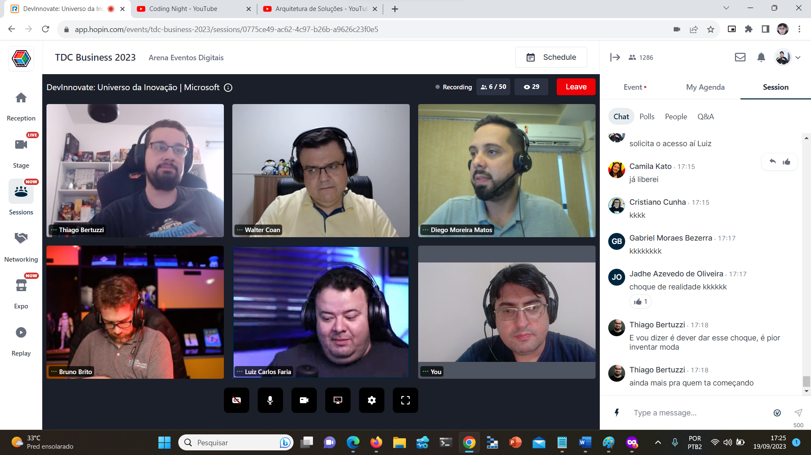

# Talk-SolutionsArchitecture-TDC_Business2023
Informações (incluindo fotos + prints) sobre apresentação online abordando o dia a dia do Arquiteto de Soluções: desafios, dicas de carreira, o exame de certificação AZ-305 (Designing Microsoft Azure Infrastructure Solutions), projetos cloud native... Talk realizada durante o TDC Business 2023 no dia 19/09/2023 (terça-feira).

Título da apresentação -> **Arquitetura de Soluções: desafios, certificações e dicas de carreira**

Página do evento: [**TDC**](https://promo.thedevconf.com/buss23-microsoft)

Público que acompanhou a apresentação: **33 pessoas** (pico de audiência ao longo da live)

Palestrantes:
- Renato Groffe (Microsoft MVP, MTAC)
- Luiz Carlos Faria (Microsoft MVP, MTAC)
- Walter Coan (Microsoft MVP)
- Diego Moreira Matos (Microsoft MVP)
- Thiago Bertuzzi (Microsoft MVP)
- Bruno Brito (Microsoft MVP)

Tecnologias abordadas: **Azure App Service, Azure Container Apps, Azure Functions, Kubernetes, Azure Kubernetes Service, Azure API Management, Azure Storage, Linux, Cost Management, Copilot, OpenTelemetry...**

Na pasta [**/img**](img/) estão outros prints do evento.

Deixamos aqui nossos agradecimentos ao **Adriano Rodrigues** pelo convite à comunidade **.NET São Paulo** e por todo o apoio para que participássemos como palestrantes na **Sala Microsoft**.

---

